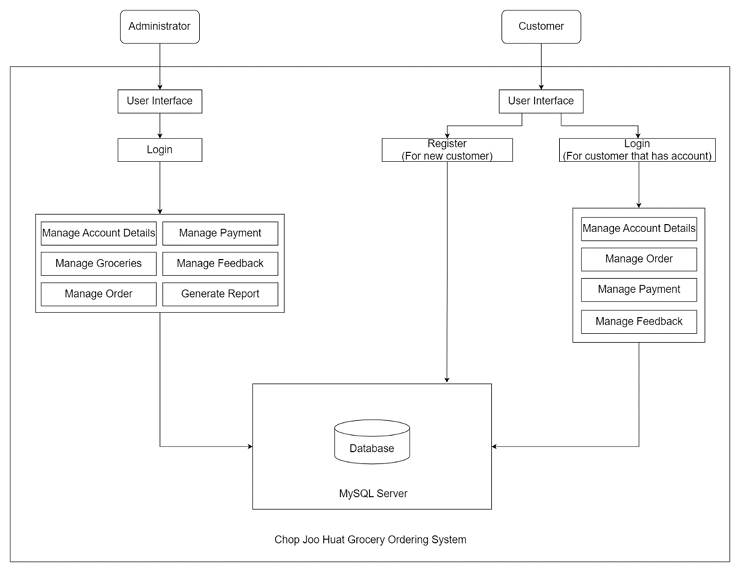
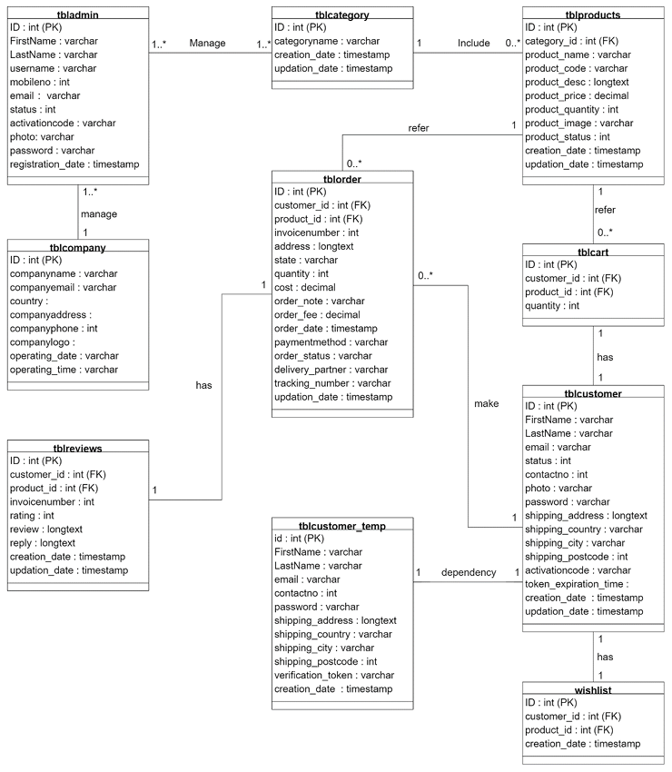

## 🏗️ System Design

The Chop Joo Huat Grocery Ordering System is a **web-based client–server application** designed using a modular architecture to ensure scalability, maintainability, and security.

### System Architecture
- **Presentation Layer**  
  - Provides user interfaces for both customers and administrators.
  - Developed using HTML, CSS, JavaScript, and Bootstrap.

- **Application Layer**  
  - Handles business logic such as authentication, order processing, payment handling, and feedback management.
  - Implemented using PHP.

- **Data Layer**  
  - Manages data storage and retrieval.
  - Uses MySQL as the relational database management system.

- **System Design Diagram**  
  - Screenshot: 

### User Roles
- **Customer**
  - Browse groceries, manage cart and wishlist, place orders, make payments, and submit feedback.
- **Administrator**
  - Manage groceries, users, orders, payments, feedback, and generate sales reports.

### Key System Components
- Authentication & Authorization Module
- Grocery Management Module
- Order & Payment Processing Module
- Feedback Management Module
- Reporting Module

---

## 🗄️ Database Design

The system uses a **relational database design** to store and manage all system data efficiently. The database is normalized to reduce data redundancy and ensure data integrity.

### Main Tables
- **tblcustomer** – Stores customer account information.
- **tblcustomer_temp** – Stores temporary customer information & login credentials before verify account.
- **tbladmin** – Stores admin account information.
- **tblcategory** – Stores grocery categories.
- **tblproducts** – Stores grocery item details and barcode values.
- **tblcart** – Stores customer shopping cart items.
- **wishlist** – Stores customer wishlist items.
- **tblorder** – Stores customer order details.
- **tblcompany** – Stores company information.
- **tblreviews** – Stores customer ratings and comments. 
- **Database Design Diagram** : 

